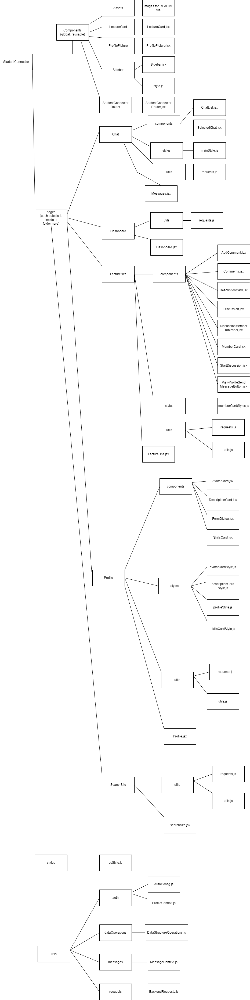
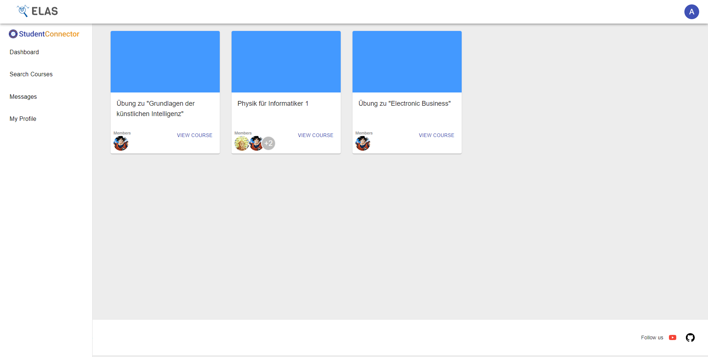
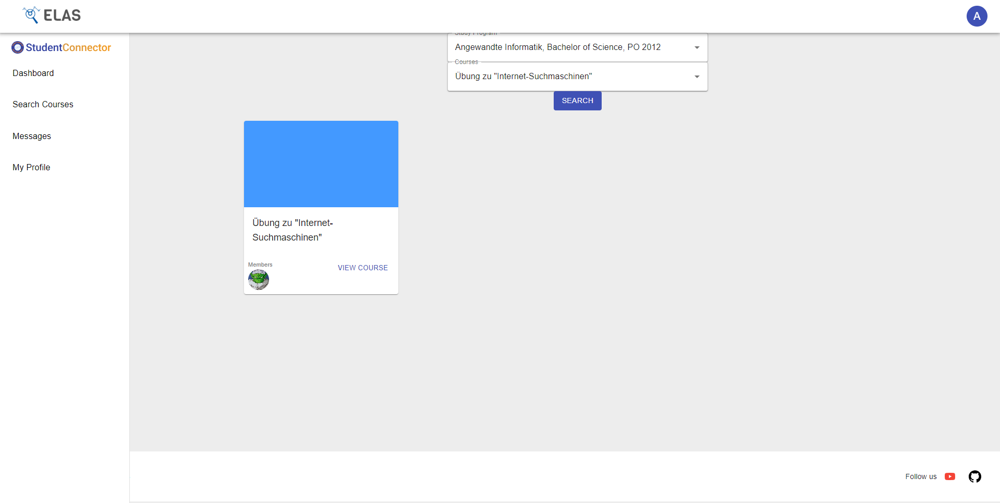
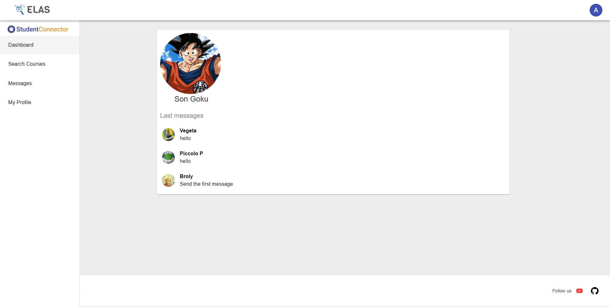
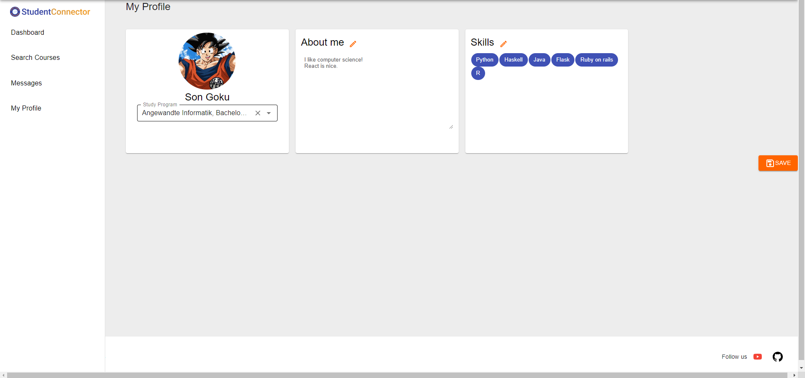
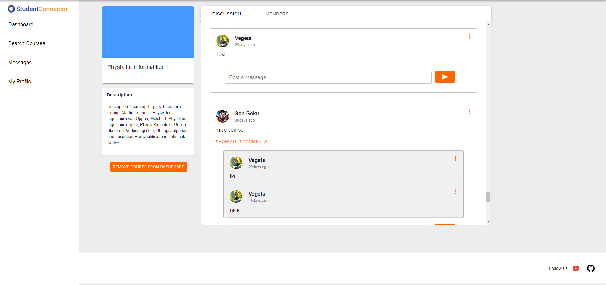
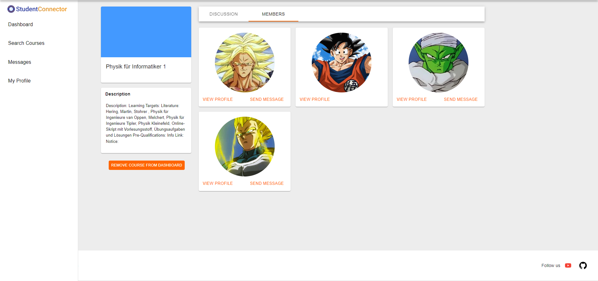

  
<h3 align="center">Connect with other students</h3>

## Table of Contents

* [Project Information](#project-information)
* [Project Architecture](#project-architecture)
* [Libraries used](#libraries-used)
* [Examples](#visualization)
* [Videos](#links)
* [Get Started](#get-started)
* [Developers](#developers)

## Project Information
StudentConnector is a web app to find other students to learn with them or to
discuss with them. It is possible to set up ones own profile and to join different courses
to then ask questions or to discuss different topics about this course. It is also possible
to see other students in the course and to directly contact them in a chat.

## Project Architecture
The architecture was chosen to be easily scalable and adaptable if 
the project will be further extended in the future and grows larger. 
The following structure can be found within the project:
- pages folder: Inside the Pages folder there is each page that is used in this
project.
  - Within each element in the pages folder there is usually a components folder
  components that are used in this page, a utils folder which contains the requests
  the backend or further helper functions and in some cases a specific styles folder
  for styles used only in this component.
- components folder: components that are reused throughout different pages
- styles folder: A folder containing global styles
- utils folder: A folder containing different global functionalities that are used
throughout the whole project. For example the usage of the context API or centralized
access to the backend is given here.  

A diagram of the used architecture can be seen here:

  
Show diagram of used architecture

    

## Libraries used
- React
- Material UI
- Flask (backend)
- Postgres database

## Examples

## Videos
<a href="https://www.youtube.com/watch?v=Cj9fKYqKolI">Advertisement Video</a>
 
<a href="https://www.youtube.com/watch?v=ozi4evvgL7Y">Demo Video</a>
## Getting started
For further reference see the README of the ELAS project.
 - Backend installation
   - Open a command prompt, move inside `backend` folder, and follow the steps below by typing the commands in your
             command prompt
    -we used python 3.10.4 in this project.

               - Install a python virtual environment

                 
                 python -m venv venv
                 

               - Activate the python virtual environment
                  .\venv\Scripts\activate
                 

               - Upgrade the pip version
                  python -m pip install --upgrade pip
                 

               - Install the required packages from the `requirements.txt` file

                 pip install -r requirements-windows.txt   # For Windows
   
                 Running the project on Linux/MacOS may result in errors since it is currently not supported. 
                 The command: pip install -r requirements-windows.txt may also work for Linux/MacOS but is 
                 not guaranteed to do so.
   
          - Type the following command in a command prompt to run server

                  python -m flask run --host=0.0.0.0

 - Frontend installation
    - Open a command prompt, move inside frontend folder, and follow the steps below by typing the commands in your command prompt
    - In this project we use  npm: '8.5.0' and  node: '16.14.2'. The most recent versions of npm and node may cause errors while running npm ci or npm install
 
    
            - Download and install node packages
    
            npm install
    
            - Run the script and starts the application
    
             npm run dev

 - Application will start automatically on [http://localhost:3000](http://localhost:3000). Backend is available at [http://localhost:5000](http://localhost:5000).

## Developers
- Janis Evers
- Mahmoud Dallah
- Tom Straub
- Luca Pazdzior
- Kirolos Zaky
